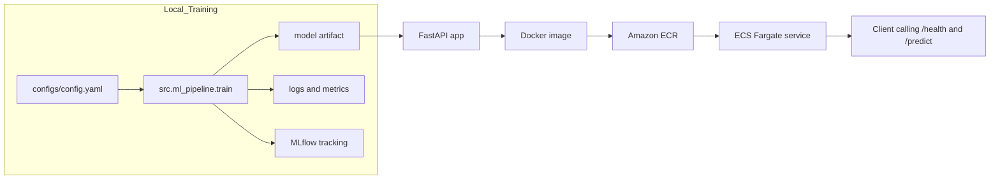

# MLOps Project 1 — End-to-End ML Pipeline + FastAPI + Docker + CI + AWS Deployment

This project implements a complete **end-to-end MLOps workflow**, taking a machine learning model from:

**Training → Experiment Tracking → Model Artifact → API Serving → Docker → CI/CD → Cloud Deployment (AWS ECS Fargate)**

It is designed to imitate how modern production ML systems are built.

---

# Features

This project includes:

- **Modular ML training pipeline** (scikit-learn Pipelines)
- **Config-driven design** using YAML
- **Experiment tracking with MLflow**
- **Logging + metrics artifacts**
- **FastAPI-based model serving**
- **Dockerized inference service**
- **Pytest test suite**
- **GitHub Actions CI pipeline**
- **AWS Deployment using ECR + ECS Fargate**

---

# How to Run Locally

## Create virtual environment & install dependencies

```bash
python3 -m venv .venv
source .venv/bin/activate
pip install -r requirements.txt
```

---

## Train the model

```bash
python -m src.ml_pipeline.train
```

This generates:

- `models/model.joblib`  
- `logs/training.log`  
- `logs/metrics.json`  
- MLflow logs under `mlruns/`

---

## Run MLflow UI

```bash
mlflow ui
```

Open: http://127.0.0.1:5000

---

## Run FastAPI server locally

```bash
uvicorn src.api.app:app --reload --port 8000
```

Test endpoints:

```bash
curl http://127.0.0.1:8000/health
```

```bash
curl -X POST "http://127.0.0.1:8000/predict" \
  -H "Content-Type: application/json" \
  -d '{"features":[0,0,0,0,0,0,0,0,0,0,0,0,0,0,0,0,0,0,0,0,0,0,0,0,0,0,0,0,0,0]}'
```

---

# Run with Docker

## Build image

```bash
docker build -t mlops-project-api .
```

## Run container

```bash
docker run -p 8000:8000 mlops-project-api
```

## Test

```bash
curl http://127.0.0.1:8000/health
```

---

# Architecture Overview

This project follows a clean MLOps architecture with separate components for:

- **Training**
- **Experiment tracking**
- **Inference API**
- **Docker packaging**
- **CI/CD**
- **Cloud deployment**

---

## Components

### **Training**
- Modular ML pipeline in `src/ml_pipeline/`
- Configuration via `configs/config.yaml`
- Outputs: `models/model.joblib`, `logs/metrics.json`, `logs/training.log`

### **Experiment Tracking**
- MLflow local tracking under `mlruns/`

### **Serving**
- FastAPI app in `src/api/app.py`
- Lazy model loading for production safety
- Endpoints:
  - `/health`
  - `/predict`

### **Containerization**
- Dockerfile builds inference-ready API container

### **CI/CD**
- GitHub Actions:
  - Installs dependencies
  - Runs tests
  - Builds Docker image

### **Cloud Deployment (AWS)**
- Image pushed to **Amazon ECR**
- Running on **AWS ECS Fargate**
- Public endpoint exposes model API

---

# High-Level Architecture Diagram




---

# AWS Deployment (ECR + ECS Fargate)

This section explains how the Dockerized API is deployed to AWS.

---

## Build **amd64 Docker image** (required for ECS Fargate)

```bash
docker buildx build \
  --platform linux/amd64 \
  -t mlops-project-api \
  . \
  --load
```

---

## Push image to Amazon ECR

```bash
ACCOUNT_ID=$(aws sts get-caller-identity --query Account --output text)

aws ecr create-repository \
  --repository-name mlops-project-1-api \
  --region us-east-1 || true

aws ecr get-login-password --region us-east-1 | \
  docker login --username AWS --password-stdin ${ACCOUNT_ID}.dkr.ecr.us-east-1.amazonaws.com

docker tag mlops-project-api:latest \
  ${ACCOUNT_ID}.dkr.ecr.us-east-1.amazonaws.com/mlops-project-1-api:latest

docker push ${ACCOUNT_ID}.dkr.ecr.us-east-1.amazonaws.com/mlops-project-1-api:latest
```

---

## Deploy on ECS Fargate

### **ECS Console Steps**

1. Create cluster → **Networking only (Fargate)**  
2. Create task definition:
   - Launch type: **Fargate**
   - Container:
     - Image URI from ECR
     - Port: **8000**
3. Create service:
   - Public IP: **ENABLED**
   - Security group: allow **TCP 8000** inbound
   - Desired tasks: **1**

---

## Test AWS Deployment

```bash
curl http://PUBLIC_IP:8000/health
```

```bash
curl -X POST "http://PUBLIC_IP:8000/predict" \
  -H "Content-Type: application/json" \
  -d '{"features":[0,0,0,0,0,0,0,0,0,0,0,0,0,0,0,0,0,0,0,0,0,0,0,0,0,0,0,0,0,0]}'
```

---

# What I Learned / Skills Demonstrated

### **ML Engineering**
- Modular ML pipeline design  
- Reproducible training via YAML configuration  

### **Experiment Tracking**
- Logged params/metrics with MLflow  
- Compared runs in MLflow UI  

### **Software Engineering**
- FastAPI inference API  
- Script-based inference  
- Lazy-loading model pattern  

### **Testing & CI**
- Pytest suite for API + pipeline  
- GitHub Actions CI (tests + Docker build)  

### **DevOps / Cloud Engineering**
- Dockerized ML API  
- Built multi-architecture Docker images  
- Stored images in Amazon ECR  
- Deployed container to AWS ECS Fargate  
- Verified public model endpoint  

### **End-to-End MLOps Pipeline**
**Train → Track → Package → Test → Containerize → Deploy → Serve**

---

# Project Status

✔️ End-to-end ML pipeline working  
✔️ Dockerized FastAPI model API  
✔️ CI pipeline  
✔️ Model deployed to AWS ECS  
✔️ Documentation complete  

---

# Acknowledgements

Built as part of a structured MLOps training program.
